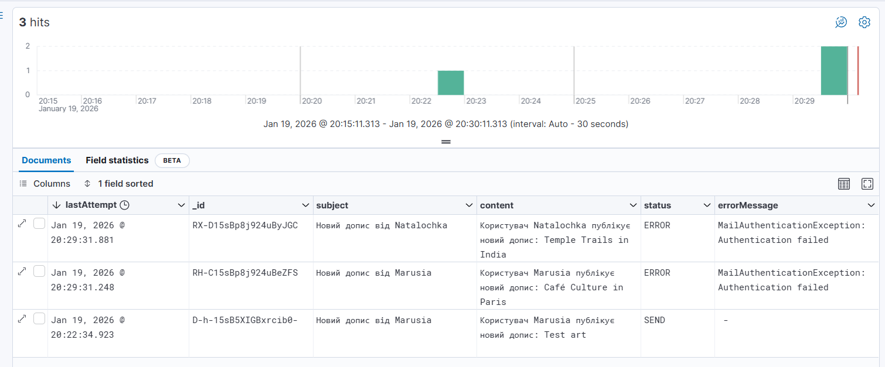

## Welcome to block5-travel-blog

При створенні сервісу до блоку 5 використано предметну область з блоків 1-4: "Блог подорожей", яка містить сутності: Допис, Користувач, Коментар.

Даний сервіс дозволяє централізовано та надійно відправляти Email-листи та відстежувати їх статус. 

До сервісу блоку 2 додано RabbitMQ для відправки повідомлень 
[block2-travel-blog] (https://github.com/YuliaKushnir/block2-travel-blog)

Таким чином здійснюється розсилка користувачам повідомлень про створення нового допису. 
В "світлому майбутньому" проект можна оптимізувати, створивши функціонал підписки на конкретного користувача, категорію дописів чи країну для отримання більш релевантних повідомлень. 

## Запуск block5-travel-blog та block2-travel-blog
Передумови: запущений docker

1. Склонувати проект з репозиторію

2. В корінь проекту block5-travel-blog додати власний файл .env з даними для конфігурації email сервісу з полями:
   MAIL_HOST=
   MAIL_PORT=
   MAIL_USER=
   MAIL_PASS=

3. Створити спільну мережу 
```sh
docker network create shared-net
```

4. Для білду image і підняття контейнерів для block5-travel-blog
Виконати команду в корені проекту
(запустить сервіси згідно завдання - для RabbitMQ, ElasticSearch, Kibanа і block5-travel-blog-mail-sender)
```sh
docker-compose up --build
```

5. Склонувати проект [block2-travel-blog] (https://github.com/YuliaKushnir/block2-travel-blog)

6. Для білду image і підняття контейнерів для block2-travel-blog
Виконати команду в терміналі на рівні з docker-compose.yml
(запустить сервіс block2-travel-blog, PostgresQL та використає RabbitMQ зі спільної мережі)

```sh
docker-compose up --build
```

Після виконання даних команд доступні сервіси на портах: 
- 8080 - block2-travel-blog
- 8081 - block5-travel-blog-mail-sender
- 5432 - postgres
- 5672 - rabbitmq (ampq)
- 15672 - rabbitmq (management plugin)
- 9200 - elasticsearch
- 5601 - kibana

## Використані технології:
- **Java 21**
- **Spring Boot 3.9.5**
- **Elasticsearch**
- **Kibana**
- **RabbitMQ**
- **Docker / Docker Compose**
- **JUnit 5 / AssertJ** для тестування
- **Testcontainers** для інтеграційного тестування

**При виборі MessageBroker надано перевагу RabbitMQ перед ApacheKafka, оскільки він забезпечує простоту конфігурації та високу надійність роботи.  
Оскільки концепція блогу подорожей не передбачає інтенсивного потоку повідомлень чи великої кількості запитів, використання RabbitMQ є більш доцільним і відповідає вимогам системи.**

### Налаштування Kibana
В Kibana налаштовано перегляд статусів відправки повідомлень:
